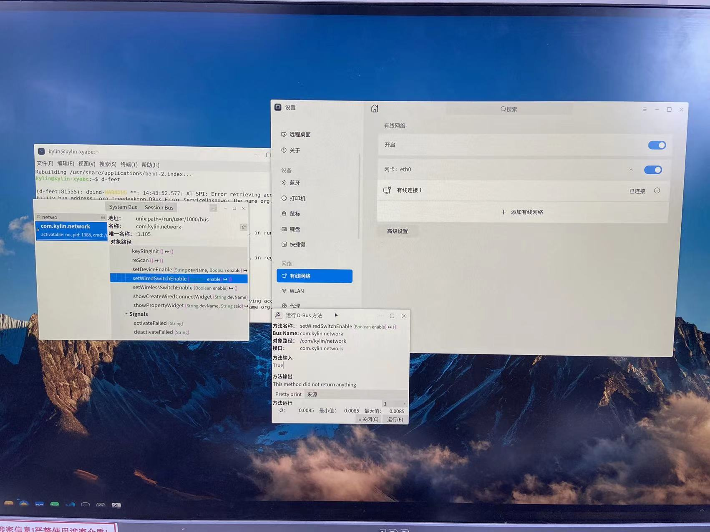

# dbusSendDemo 说明

> 演示如何通过 `session dbus` 和 `system` 方式来实现[麒麟桌面操作系统的应用控制](https://docs.qq.com/doc/DU0lGSWN1VVNHVXJQ)。

本文目录
=================

* [dbusSendDemo](#dbussenddemo-说明)
   * [一、session dbus 方式](#一session-dbus-方式)
   * [二、system 方式](#二system-方式)

## 一、session dbus 方式

**前置条件：**  [dbusSendDemo.pro](./dbusSendDemo.pro) 中需要增加 `dbus` 模块。

**相关文件：**  `daemonipcdbus.cpp, daemonipcdbus.h`

[daemonipcdbus.cpp](./daemonipcdbus.cpp) 和 [daemonipcdbus.h](./daemonipcdbus.h) 是 `session dbus` 的调用演示模板，

通过在[widget.cpp](./widget.cpp)中的 `setWiredSwitchEnable`函数调用，则可以实现 

**打开有线网络**的功能。

## 二、system 方式

[widget.cpp](./widget.cpp) 中 `openUkccNetwork`函数调用是 `system`方式调用演示模板，

该 `openUkccNetwork` 函数可以实现打开 **设置中有线网络设置页面** 的功能。
